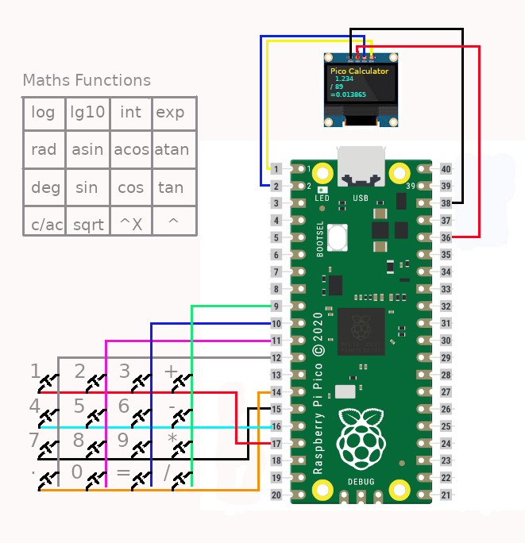

# Pico_Calculator

Simple calculator based on a Raspberry Pi Pico, SSD1306 display and a matrix keyboard.
Written in Micropython.

It can peform simply calculations eg +,-,* or /, as well as some maths functions eg log, ^X etc

## Schematic

Copy https://github.com/stlehmann/micropython-ssd1306/blob/master/ssd1306.py tp the pico

Copy main.py to the pico

To carry out a simple addition:

Press 1.234
Press +
Press 2.345
Press =

To clear a number, in case of an error, press . for > 1 second and release.

To clear the screen press . for > 3 seconds and release.

To carry out a maths function, eg log10(1.234):

Press 1.234
Press and hold 2 for > 1 second and release
the result will be shown 0.09131514

To clear press . for > 1 second and release
or you can do further calculations on the result

Pressing = BEFORE entering a number will make it -ve
